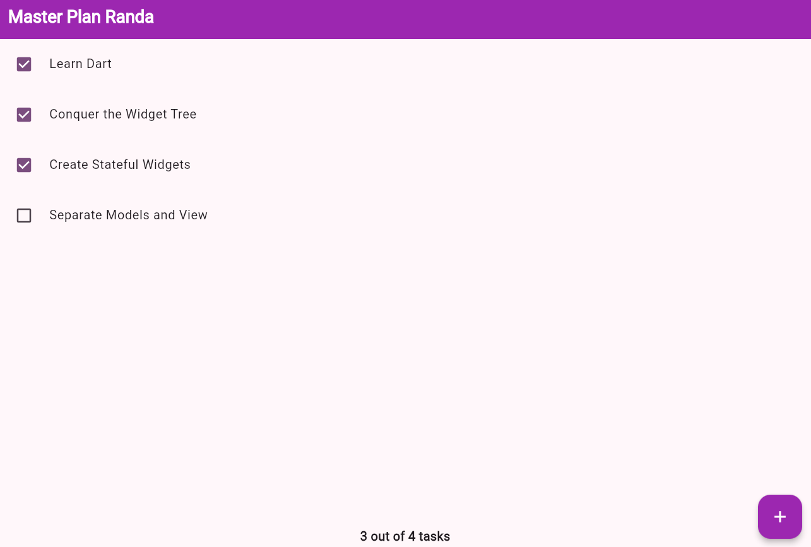
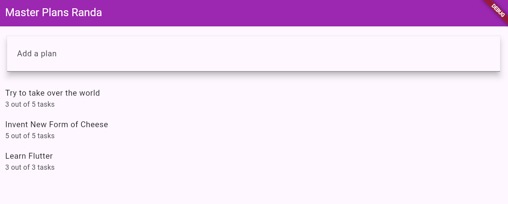
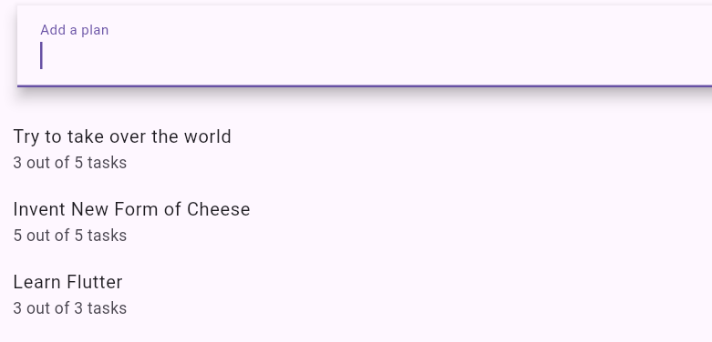
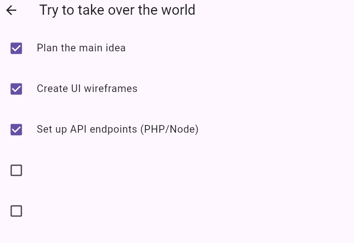

# Laporan Praktikum 1

**Pemrograman Mobile - Membangun Navigasi di Flutter**

---

## Identitas

* **Nama**       : Randa Heru Kusuma  
* **NIM**        : 2341760009  
* **Praktikum**  : 10 - Membangun Navigasi di Flutter  

---

## Hasil

Berikut adalah tampilan hasil praktikum 1:

Hasil Pertama
  
Hasil Kedua
 

---

## Deskripsi Praktikum

Pada praktikum ini dipelajari bagaimana cara **membangun navigasi antar halaman di Flutter** menggunakan `Navigator` dan `MaterialPageRoute`, serta penerapan pengiriman data antar halaman.

Poin penting yang dipelajari:

* Implementasi **navigasi dasar** dengan `Navigator.push()` dan `Navigator.pop()`.  
* Penggunaan **named route** untuk navigasi yang lebih terstruktur.  
* Pengiriman **data antar halaman** menggunakan `arguments`.  
* Penerapan **Hero animation** untuk transisi antar halaman yang lebih menarik.  
* Penerapan **GridView** dalam menampilkan daftar produk dengan desain modern.  

Praktikum ini bertujuan agar mahasiswa mampu memahami konsep navigasi dalam Flutter, serta dapat mengimplementasikan perpindahan antar halaman dengan data dinamis pada aplikasi yang lebih kompleks.

---

## Kesimpulan
Dari praktikum ini, dapat disimpulkan bahwa **navigasi merupakan komponen penting dalam pengembangan aplikasi Flutter**. Dengan memanfaatkan named routes dan arguments, developer dapat mengatur alur berpindah halaman secara efisien dan terstruktur. Selain itu, penggunaan animasi dan layout yang baik meningkatkan pengalaman pengguna secara keseluruhan..

---

# Laporan Praktikum 2

**Pemrograman Mobile - Mengelola Data Layer dengan InheritedWidget dan InheritedNotifier**

---

## Identitas

* **Nama**       : Randa Heru Kusuma  
* **NIM**        : 2341760009  
* **Praktikum**  : 2 - Mengelola Data Layer dengan InheritedWidget dan InheritedNotifier

---

## Hasil

Berikut adalah tampilan hasil praktikum 2:

Hasil
   

---

## Deskripsi Praktikum

Pada praktikum ini dipelajari bagaimana cara **membangun navigasi antar halaman di Flutter** sekaligus **mengelola state dengan InheritedNotifier/ValueNotifier**. Poin penting yang dipelajari:

* Implementasi **navigasi dasar** dengan `Navigator.push()` dan `Navigator.pop()`.  
* Penggunaan **ValueNotifier** dan `InheritedNotifier` untuk manajemen state.  
* Pembuatan **daftar task dinamis** dengan ListView, Checkbox, dan TextFormField.  
* Menampilkan **progress task** secara real-time di footer menggunakan method `completenessMessage`.  
* Menggunakan **floating action button** untuk menambah task baru secara interaktif.  

Praktikum ini bertujuan agar mahasiswa mampu memahami **state management dan navigasi** dalam Flutter, serta membuat UI yang responsif terhadap perubahan data.

---

## Kesimpulan

Dari praktikum ini, dapat disimpulkan bahwa **state management dan navigasi adalah komponen penting dalam pengembangan aplikasi Flutter**. Dengan menggabungkan InheritedNotifier, ValueNotifier, dan navigasi, developer dapat:

* Mengatur alur berpindah halaman secara efisien.  
* Memperbarui UI otomatis saat data berubah.  
* Menampilkan progress task secara real-time.  
* Membuat aplikasi lebih interaktif dan mudah dikelola.  

Praktikum ini menekankan pentingnya **memisahkan logika bisnis dan UI**, sehingga kode lebih bersih dan mudah dipelihara.

---

# Praktikum 3 - Flutter: Membuat State di Multiple Screens

**Pemrograman Mobile - Mengelola State di Multiple Screens dengan InheritedNotifier**

---

## Identitas

- **Nama**       : Randa Heru Kusuma  
- **NIM**        : 2341760009  
- **Praktikum**  : 3 - Membuat State di Multiple Screens

---

## Deskripsi

Praktikum ini bertujuan untuk memahami konsep **"Lift State Up"** dalam Flutter, yaitu menempatkan state lebih tinggi dalam widget tree agar bisa diakses oleh banyak screen.  

Materi yang dipelajari meliputi:

- Mengubah `PlanProvider` agar dapat menangani **List Plan**.  
- Membuat screen baru `PlanCreatorScreen` untuk menambah Plan.  
- Menghubungkan `PlanScreen` dengan `PlanProvider` untuk mengelola daftar task.  
- Implementasi navigasi antar screen dengan `Navigator.push()`.  
- Mengupdate UI secara otomatis menggunakan `ValueNotifier` dan `ValueListenableBuilder`.  

Praktikum ini menekankan pentingnya **state management lintas screen** agar aplikasi lebih fleksibel, interaktif, dan mudah dikelola.

---

## Hasil Praktikum

1. Tampilan awal Plan Creator:  
  

2. Menambahkan Plan baru dan melihat daftar plan:  
  

3. Membuka Plan individual untuk mengelola task:  
  

---

## Kesimpulan

Dari praktikum ini dapat disimpulkan bahwa:

- State management di Flutter harus **di-lift** agar bisa digunakan di banyak screen.  
- `InheritedNotifier` dan `ValueNotifier` memungkinkan data **terupdate otomatis** di seluruh widget yang tergantung padanya.  
- Penggunaan **List** untuk menyimpan beberapa Plan mempermudah manajemen data dan navigasi antar plan.  
- Developer dapat membuat aplikasi yang **dinamis dan interaktif**, di mana penambahan plan baru langsung terlihat di UI tanpa perlu reload.  
- Praktikum ini memperkuat konsep **memisahkan logika bisnis dan UI**, sehingga kode lebih rapi dan mudah dipelihara.  

Dengan demikian, penguasaan **state management lintas screen** menjadi kunci dalam membangun aplikasi Flutter yang kompleks dan scalable.
