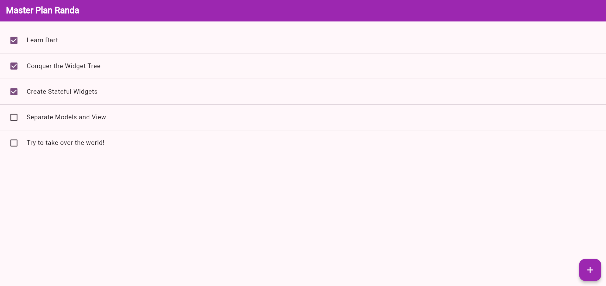

# Laporan Praktikum 1

**Pemrograman Mobile - Membangun Navigasi di Flutter**

---

## Identitas

* **Nama**       : Randa Heru Kusuma  
* **NIM**        : 2341760009  
* **Praktikum**  : 10 - Membangun Navigasi di Flutter  

---

## Hasil

Berikut adalah tampilan hasil praktikum 1:

Hasil Pertama
  
Hasil Kedua
 

---

## Deskripsi Praktikum

Pada praktikum ini dipelajari bagaimana cara **membangun navigasi antar halaman di Flutter** menggunakan `Navigator` dan `MaterialPageRoute`, serta penerapan pengiriman data antar halaman.

Poin penting yang dipelajari:

* Implementasi **navigasi dasar** dengan `Navigator.push()` dan `Navigator.pop()`.  
* Penggunaan **named route** untuk navigasi yang lebih terstruktur.  
* Pengiriman **data antar halaman** menggunakan `arguments`.  
* Penerapan **Hero animation** untuk transisi antar halaman yang lebih menarik.  
* Penerapan **GridView** dalam menampilkan daftar produk dengan desain modern.  

Praktikum ini bertujuan agar mahasiswa mampu memahami konsep navigasi dalam Flutter, serta dapat mengimplementasikan perpindahan antar halaman dengan data dinamis pada aplikasi yang lebih kompleks.

---

## Kesimpulan
Dari praktikum ini, dapat disimpulkan bahwa **navigasi merupakan komponen penting dalam pengembangan aplikasi Flutter**. Dengan memanfaatkan named routes dan arguments, developer dapat mengatur alur berpindah halaman secara efisien dan terstruktur. Selain itu, penggunaan animasi dan layout yang baik meningkatkan pengalaman pengguna secara keseluruhan..

---

